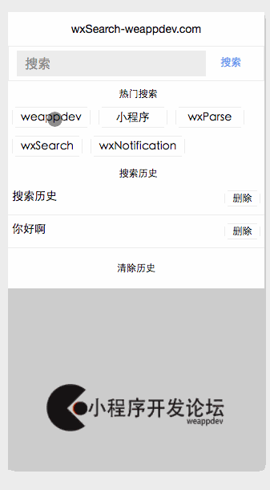
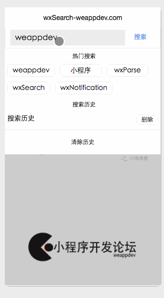

# wxSearch

- 🔍 微信小程序优雅的搜索框

## 来源

## wxParse信息

* 版本号`0.1`
* github地址: [https://github.com/icindy/wxSearch](https://github.com/icindy/wxSearch)

##  开发信息

[微信小程序开发论坛](http://weappdev.com)
垂直微信小程序开发交流社区


## 特性


- [x] 支持自定义热门key
- [x] 支持搜索历史
- [x] 支持搜索建议
- [x] 支持搜索历史（记录）缓存

## 效果




## 使用

＊ 引入
```
// 模版引入
<import src="/wxSearch/wxSearch.wxml"/>
<template is="wxSearch" data="{{wxSearchData}}"/>
// wxss中引入
@import "/wxSearch/wxSearch.wxss";
```
＊ 使用

```
//wxSearch 暴漏的接口

module.exports = {
    init: init,
    initColor: initColors,
    initMindKeys: initMindKeys,
    wxSearchInput: wxSearchInput,
    wxSearchFocus: wxSearchFocus,
    wxSearchBlur: wxSearchBlur,
    wxSearchKeyTap: wxSearchKeyTap,
    wxSearchAddHisKey:wxSearchAddHisKey,
    wxSearchDeleteKey:wxSearchDeleteKey,
    wxSearchDeleteAll:wxSearchDeleteAll,
    wxSearchHiddenPancel:wxSearchHiddenPancel
}

```

```
//初始化
onLoad: function () {
    console.log('onLoad')
    var that = this
    //初始化的时候渲染wxSearchdata 第二个为你的search高度
    WxSearch.init(that,43,['weappdev','小程序','wxParse','wxSearch','wxNotification']);
    WxSearch.initMindKeys(['weappdev.com','微信小程序开发','微信开发','微信小程序']);
},

```

```
wxSearchFn: function(e){
    var that = this
    WxSearch.wxSearchAddHisKey(that);
    
  },
  wxSearchInput: function(e){
    var that = this
    WxSearch.wxSearchInput(e,that);
  },
  wxSerchFocus: function(e){
    var that = this
    WxSearch.wxSearchFocus(e,that);
  },
  wxSearchBlur: function(e){
    var that = this
    WxSearch.wxSearchBlur(e,that);
  },
  wxSearchKeyTap:function(e){
    var that = this
    WxSearch.wxSearchKeyTap(e,that);
  },
  wxSearchDeleteKey: function(e){
    var that = this
    WxSearch.wxSearchDeleteKey(e,that);
  },
  wxSearchDeleteAll: function(e){
    var that = this;
    WxSearch.wxSearchDeleteAll(that);
  },
  wxSearchTap: function(e){
    var that = this
    WxSearch.wxSearchHiddenPancel(that);
  }
```
